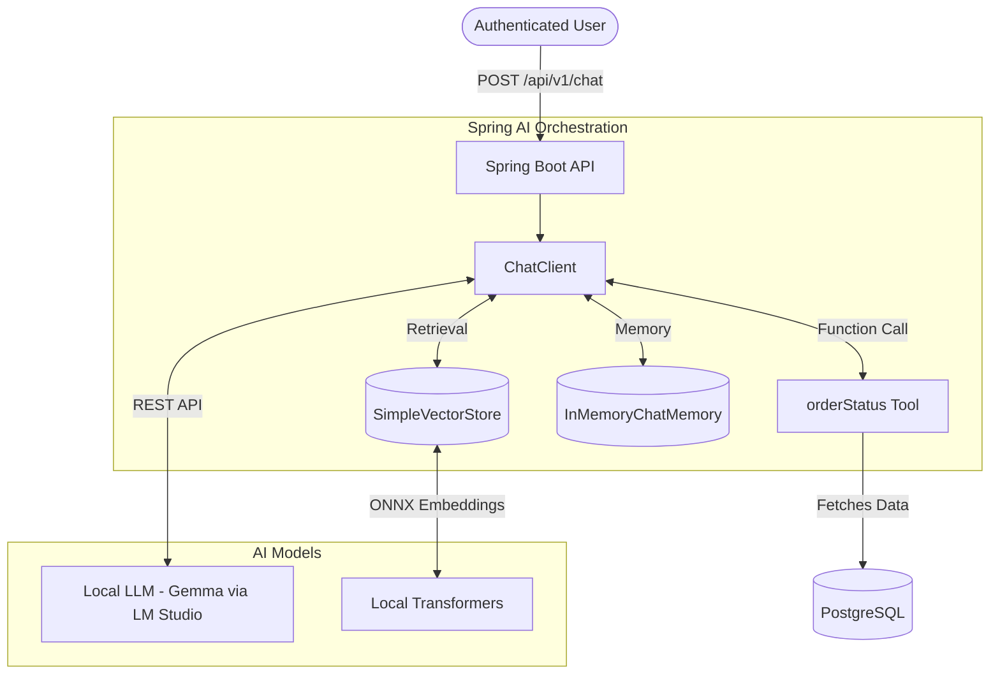

# Architectural Decisions & System Design

This document outlines the core architectural decisions made in the Modernized E-Commerce API, emphasizing scalability, performance, security, and the integration of Agentic AI.

## 1. Modular Monolith & Domain-Driven Design (DDD)

We deliberately chose a **Modular Monolith** over a distributed Microservices architecture. 

### Why?
- **Reduced Operational Complexity**: Eliminates network latency, distributed transactions (Sagas), and complex service meshes during the early-to-mid stages of product growth.
- **Microservice-Ready**: By strictly adhering to **Hexagonal Architecture (Ports & Adapters)**, Bounded Contexts (`Order`, `Catalog`, `Cart`) are deeply decoupled. They communicate exclusively through interfaces (`UseCases`), meaning any module can be extracted into a standalone microservice simply by swapping its Adapter.
- **Rich Domain Model**: Core business rules are encapsulated in pure Java objects (e.g., `Cart.java`), not Anemic Data Models attached to ORM frameworks. This ensures the domain is entirely agnostic of Spring Boot or JPA, allowing for sub-millisecond, frameworkless unit testing.

## 2. High-Performance Concurrency (Java 26 & Virtual Threads)

To handle massive Black Friday-level throughput, the system employs advanced concurrency patterns and Java 26 preview features.

### Structured Concurrency
We utilize Java 26's `StructuredTaskScope` for massive scatter-gather read operations (e.g., fetching product details across multiple downstream services simultaneously). However, we explicitly avoid using virtual threads or structured concurrency within write-heavy `@Transactional` boundaries (like Order Checkout) to ensure Spring's `ThreadLocal` transaction contexts remain intact and ACID guarantees are strictly enforced.

### Deadlock Prevention
In the `Catalog` module, pessimistic locking is used during checkout inventory reservation. To mathematically prevent distributed deadlocks under heavy concurrent load, the system sorts all requested Product IDs alphabetically before acquiring row-level database locks (`SELECT ... FOR UPDATE`).

### Virtual Thread Optimizations
To prevent "Thread Pinning" anomalies (where a Virtual Thread blocks the underlying OS carrier thread), we ensure that heavily synchronized code blocks are eliminated. For instance, Jackson's `ObjectMapper` is explicitly configured within an immutable Bean layer to guarantee thread-safe serialization during asynchronous payload processing.

## 3. Agentic AI & RAG (Spring AI)

The platform features an intelligent, secure Customer Support Agent powered by **Spring AI 1.0.0-M2**.

### Architecture


### Key AI Decisions:
- **Local-First & Privacy**: Instead of sending sensitive e-commerce queries to OpenAI, the system connects to a local instance of **LM Studio** running Gemma. Embeddings for the RAG pipeline are generated entirely offline within the Java process using `spring-ai-transformers` (ONNX).
- **Retrieval-Augmented Generation (RAG)**: The chatbot is augmented with a store policy document (`faq.txt`). Queries are intercepted by a `QuestionAnswerAdvisor` which fetches semantically relevant policies from the `VectorStore`.
- **Conversational Memory**: A `MessageChatMemoryAdvisor` tracks conversation history keyed to the authenticated user's session, allowing for natural follow-up questions without losing context.

## 4. Enterprise Security & BOLA Prevention

Authentication is managed via **Keycloak (OAuth2/OIDC)**. The Spring Boot application acts strictly as a stateless Resource Server.

### Fixing AI Tool Context Loss
A common vulnerability in Agentic AI is **BOLA (Broken Object Level Authorization)**, where an LLM is tricked into fetching data belonging to another user. Furthermore, AI agents often execute asynchronous Tool/Function calls on different threads, which causes traditional `ThreadLocal` security contexts (like `SecurityContextHolder`) to drop.

### The Solution:
Instead of relying on fragile `ThreadLocal` propagation, the `ChatController` explicitly extracts the JWT Subject (User ID) at the HTTP boundary. This ID is then securely bound directly into the Tool's closure (a dynamically generated `FunctionCallbackWrapper`). 

```java
// The authenticated userId is permanently captured in this lambda closure
Function<OrderStatusRequest, OrderResponse> tool = 
    request -> orderUseCase.getOrder(userId, request.orderId());
```
This mathematically guarantees that the AI can only ever invoke the backend system using the verified identity of the user making the request, regardless of which virtual thread executes the tool.
