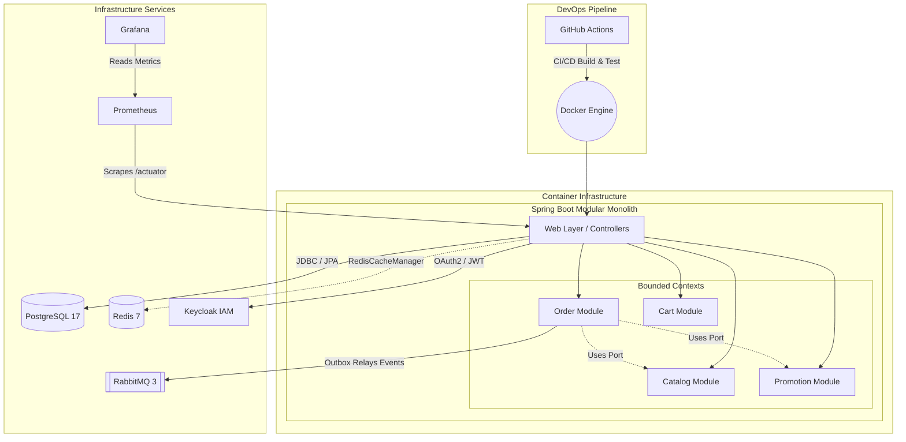
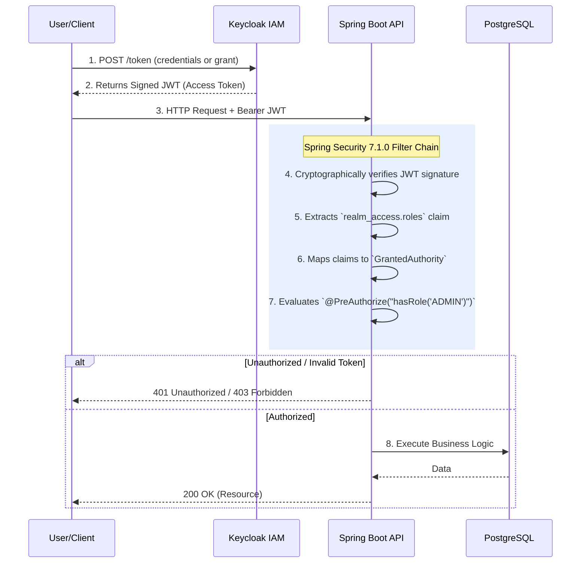
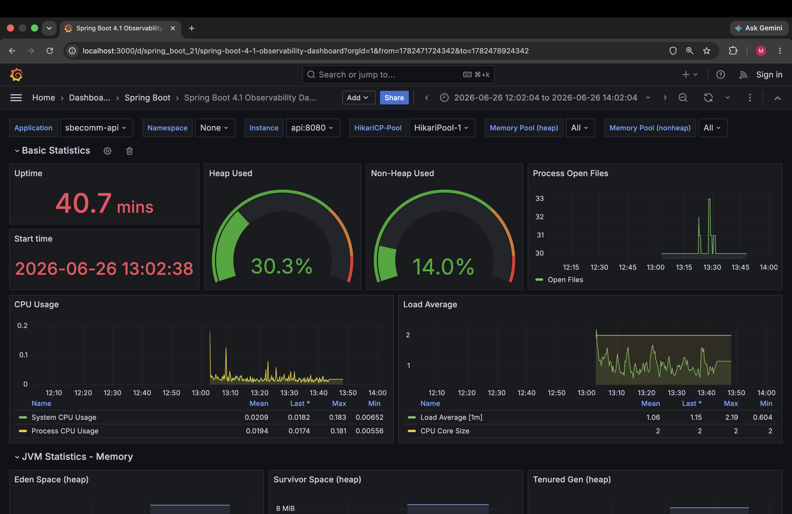
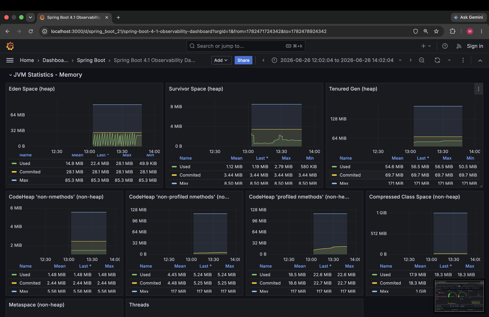
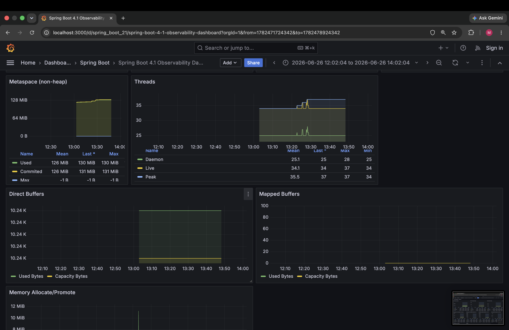
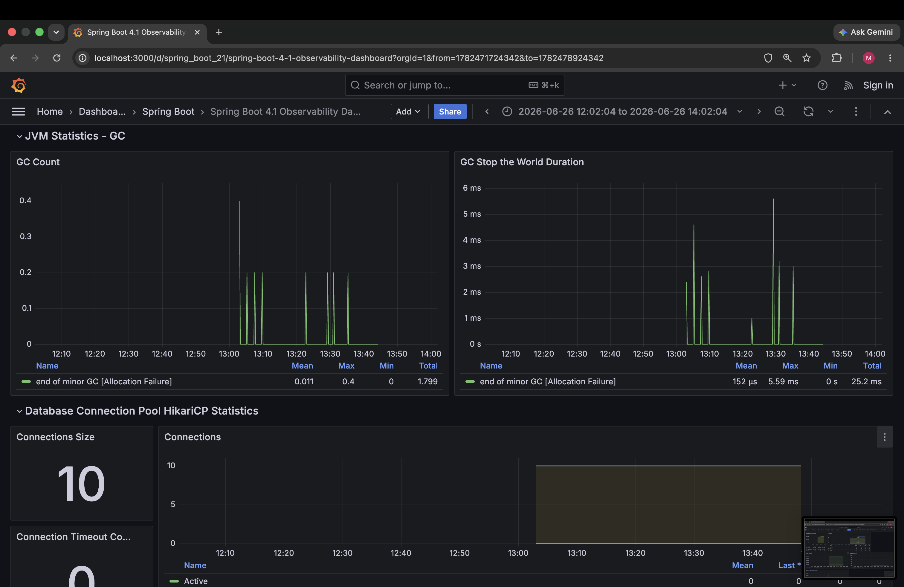
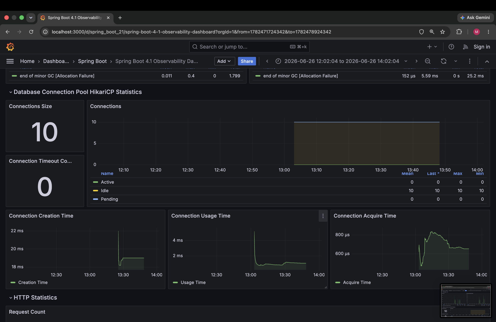
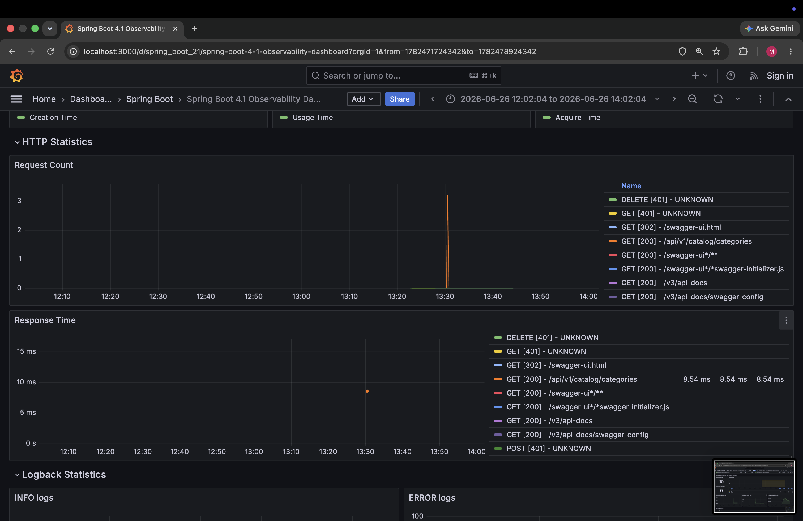
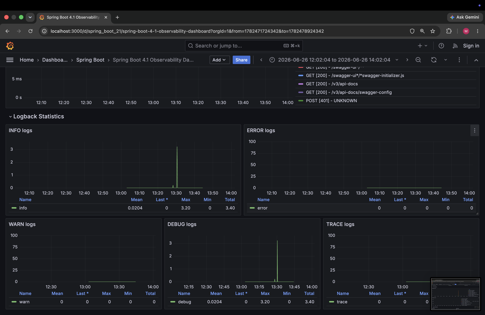

# Modernized E-Commerce API


An enterprise-grade, highly scalable e-commerce backend built with **Spring Boot 4.1.0** and **Java 26**. This project serves as a showcase for modern backend engineering, emphasizing clean architecture, strict security, and robust DevOps practices.

---

## Architecture

### System Overview


This application strictly adheres to **Domain-Driven Design (DDD)** and **Hexagonal Architecture (Ports & Adapters)**. 

### Why a Modular Monolith?
Microservices often introduce unnecessary complexity (network latency, distributed transactions) for early-stage applications. This project implements a **Modular Monolith**—the application deploys as a single Spring Boot artifact, but the internal code is strictly segregated into independent Bounded Contexts (`Order`, `Cart`, `Catalog`, `Promotion`).

- **Separation of Concerns**: Modules do not share databases or directly invoke each other's `@Service` classes. They communicate strictly through interfaces (`UseCases`), ensuring loose coupling.
- **Microservice-Ready**: If business requirements dictate that the `Catalog` module must scale independently, it can be seamlessly extracted into a dedicated microservice by simply swapping its Adapter, without altering the core Domain logic.
- **Rich Domain Model**: Business rules (e.g., Cart subtotal calculations, Promotion validations) are encapsulated in pure Java objects (`Cart.java`) rather than Anemic Domain Models (`@Entity` classes), making testing lightning fast and independent of the Spring framework.

### Project Structure
The codebase strictly adheres to Hexagonal Architecture, isolating Domain Models from Infrastructure frameworks.

```text
src/main/java/com/sbecomm/modernized/
├── common/             # Cross-cutting concerns (Security, Exceptions, Configs, Logging)
├── cart/               # Bounded Context: Shopping Cart
├── catalog/            # Bounded Context: Product Catalog
├── order/              # Bounded Context: Order Processing
├── payment/            # Bounded Context: Payment Gateway
├── promotion/          # Bounded Context: Discount Codes
└── user/               # Bounded Context: User Management & Authentication
```

**Inside Every Bounded Context:**
```text
├── application/    # Services & UseCases (Ports / Inbound & Outbound Interfaces)
│   ├── dto/        # Request/Response Data Transfer Objects
│   ├── port/       # Interfaces defining what the module needs to do
│   └── service/    # Application Logic orchestration
├── domain/         # Pure Java Rich Domain Models & Core Business Rules
│   ├── exception/  # Domain-specific exceptions
│   ├── model/      # Aggregates and Entities (Zero Spring/JPA dependencies)
│   └── repository/ # Interfaces for data storage (Outbound Ports)
├── infrastructure/ # Framework-specific Adapters (Database, external APIs)
│   ├── adapter/    # Implementations of Domain Repositories (JPA, Stripe API)
│   └── entity/     # JPA @Entity classes mapping to PostgreSQL tables
└── presentation/   # Web Layer Adapters
    └── rest/       # Spring MVC @RestControllers
```

---

## Enterprise Security & IAM (Spring Security 7.1.0)

The application implements a robust zero-trust security model leveraging **Spring Security 7.1.0** and **Keycloak**. It operates purely as a stateless OAuth2 Resource Server.

### Authentication & Authorization Flow



### Key Security Features:

- **Stateless OAuth2 Resource Server**: The API does not store any session state. Every request must be authenticated via a cryptographically signed JSON Web Token (JWT).
- **Custom JWT Converter**: We implement a custom `JwtAuthenticationConverter` to seamlessly map Keycloak's deeply nested `realm_access.roles` directly into native Spring Security `SimpleGrantedAuthority` objects, avoiding generic scope mapping.
- **Method-Level Security (RBAC)**: Fine-grained Role-Based Access Control is enforced at the controller layer using `@PreAuthorize("hasRole('ADMIN')")`.
- **CORS & CSRF Protection**: Cross-Origin Resource Sharing is strictly configured, and CSRF is disabled appropriately for a stateless JWT-based API architecture.

---

## DevOps & Containerization

The infrastructure is hardened for production and adheres to strict DevSecOps principles:

- **Immutable & Hardened Docker Containers**:
  - Runs as a non-root `spring` user to prevent privilege escalation.
  - Drops all Linux Kernel capabilities (`cap_drop: ALL`).
  - Enforces a Read-Only root filesystem to prevent malware downloads (`read_only: true` with `/tmp` mounted as `tmpfs`).
- **Resource Management**: Strict CPU and Memory limits prevent container starvation (`deploy.resources.limits`).
- **Advanced CI/CD Pipeline (GitHub Actions)**:
  - Parallelized jobs for `test` and `security-scan`.
  - Automated vulnerability scanning using **Trivy**.
  - Aggressive Docker Buildx layer caching.
  - Automated secure push to the GitHub Container Registry (GHCR).

---

## Observability & Monitoring



<details>
<summary><b>View more dashboard panels (JVM, Connections, HTTP, Logs)</b></summary>







</details>

This application comes completely pre-wired with an enterprise-grade observability stack that spins up automatically via Docker Compose. It actively monitors the health, performance, and traffic of the Spring Boot API in real-time.

**The Stack:**
- **Micrometer & Actuator:** Instruments the Spring Boot 4.1 API and exposes a `/actuator/prometheus` endpoint.
- **Prometheus:** A time-series database configured to aggressively scrape the API metrics every 5 seconds.
- **Grafana:** Provides stunning, real-time data visualization. We auto-provision the official **Spring Boot 4.1 Observability Dashboard** so it's ready the second the container boots.

**What is Tracked?**
- **HTTP Traffic:** Tracks p95 / p99 request latency, request throughput (requests/sec), and HTTP error rates (4xx vs 5xx).
- **JVM Health:** Monitors JVM Heap utilization, Garbage Collection pauses, and active Daemon threads.
- **HikariCP Connection Pool:** Tracks active vs. idle PostgreSQL database connections to prevent database bottlenecking.

---

## Quick Start (Local Development)

### Prerequisites
- Docker & Docker Compose
- Java 26 (If running outside of Docker)

### Running the Application

Because the entire infrastructure is containerized, you can spin up the API, PostgreSQL Database, Keycloak Server, Prometheus, and Grafana with a single command:

```bash
# 1. Clone the repository
git clone https://github.com/yourusername/modernized-ecomm.git
cd modernized-ecomm

# 2. Build and start the infrastructure
docker-compose up --build -d
```

### Accessing the Services
- **E-Commerce API**: `http://localhost:8080`
- **Keycloak Admin Console**: `http://localhost:8081` (Login: `admin` / `secure_admin_pass_123`)
- **Grafana Dashboards**: `http://localhost:3000` (Zero-Config Anonymous Access - No login required!)
- **Prometheus UI**: `http://localhost:9090`

*(Note: Secrets are managed via a `.env` file for local development).*

---

## Testing

The core domain logic is framework-agnostic, allowing for sub-millisecond execution of unit tests.

```bash
# Run all Unit and Integration tests
./mvnw clean test
```

---

*Built with ❤️ focusing on clean code, testability, and modern enterprise standards.*
